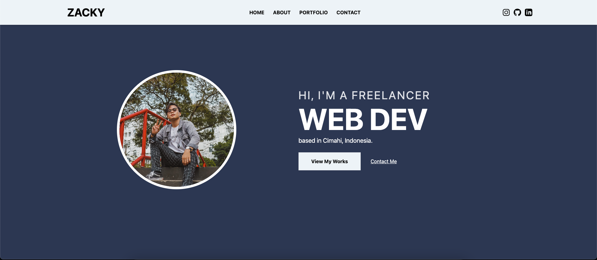

# Personal Website

This project is a personal website designed to showcase an individual's portfolio, projects, and skills to potential clients or recruiters. This website was created as part of the first month's assignment in the bootcamp organized by [Bearmentor Indonesia](https://github.com/bearmentor-community).

<details>
  <summary>
  Preview
  </summary>
  
</details>

## Resources

- **Design Mockup:** Explore the design on [Figma](https://www.figma.com/design/iNwDAvrafvxCMVHNHcmBnp/Zacky's-Portfolio).
- **Project Preview:** Preview the project on [Vercel](https://zacky-achmad.vercel.app/).
- **Project Logbook:** Accessible through the [Logbook Zacky](https://github.com/zckyachmd/logbook-zacky).

## Technologies Used

- **HTML**
- **CSS** with Tailwind CSS and Post CSS
- **JavaScript** (where necessary)

## Features

- [x] Accessibility: Ensure your website is accessible to all users.
- [x] Responsive Design: Seamlessly adapts to diverse screen sizes.
- [x] Navigation: Navigate through the website with ease.
- [x] Home: Welcome your visitors with a captivating landing page.
- [x] About: Introduce yourself to your audience.
- [x] Projects: Showcase your projects and contributions.
- [x] Contact: Connect with your audience.
- [x] SEO Optimized: Improve your website's visibility on search engines.
- [x] Performance Optimized: Enhances performance through stylesheet optimization using Post CSS.

## Installation

To get a local copy up and running, follow these steps:

<details>
<summary>Expand for instructions</summary>

### Step

1. Clone the repository.

```bash
git clone https://github.com/zckyachmd/zacky.id
```

2. Navigate to the project directory.

```bash
cd personal-website
```

3. Install the dependencies.

```bash
npm install
```

4. Start the development server.

```bash
npm run dev
```

5. Open the `index.html` file in your preferred browser.
</details>

## License

This project is open source and available under the [MIT License](LICENSE).

## Author

Copyright © 2024 [Zacky](https://zacky.id). Full-Stack Developer and Tech Enthusiast.
